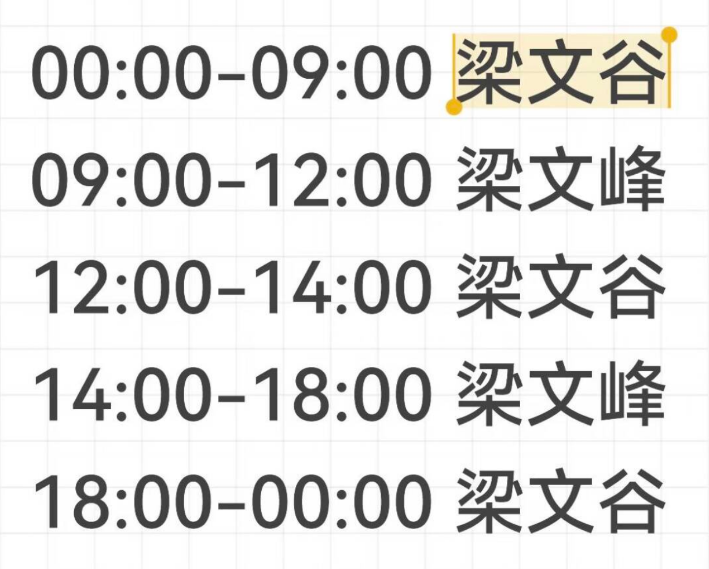

# DSH-peakseek

DeepSeek Harness 的模型价格提示插件。

## 这是什么？

这个插件会在 DSH Web UI 输入框中显示当前计费时段，并提供 DeepSeek 官方模型价格查询卡片。



DeepSeek 的模型价格也开始“分时段上班”了：

- 00:00–09:00：梁文谷时间，价格较低，适合夜猫子和预算管理大师；
- 09:00–12:00：梁文峰时间，算力一上班，钱包也开始上班；
- 12:00–14:00：梁文谷时间，午休不只是人需要，账单也需要喘口气；
- 14:00–18:00：梁文峰时间，下午继续冲刺，token 也跟着加班；
- 18:00–00:00：梁文谷时间，终于可以让钱包下班了。

## 功能

- 高峰时段显示“现在是梁文峰时间”；
- 空闲时段显示“现在是梁文谷时间”；
- 点击提示查看 DeepSeek 官方模型价格；
- 空闲时段价格按高峰价格的一半显示；
- 悬浮卡片支持浅色、深色和跟随系统主题；
- 价格来源：[DeepSeek 官方定价页面](https://api-docs.deepseek.com/zh-cn/quick_start/pricing/)；
- 只修改已经部署好的 DSH，不重新克隆完整 DSH。

## 一键部署

请把 Release 中的 `DSH-peakseek-installer.bat` 和 `dsh-peakseek.patch` 解压到已经部署好的 `deepseek-harness` 文件夹的上一级目录：

```text
DSH\
├─ deepseek-harness\
├─ DSH-peakseek-installer.bat
└─ dsh-peakseek.patch
```

然后直接双击 `DSH-peakseek-installer.bat`。脚本只会修补同目录下的 `deepseek-harness`，不搜索其他目录、不询问安装路径，并自动完成：

1. 应用插件补丁；
2. 安装依赖并重新构建 Web UI；
3. 启动 DSH Web UI。

如果只下载了 `.bat` 文件，脚本会自动从最新 Release 下载补丁文件。

## 使用要求

- Git
- Node.js 22 或更高版本
- pnpm 11.7.0 或更高版本
- 已经部署好的 DSH Git 仓库

如果 DSH 目录存在未提交修改，安装程序会停止运行，以避免覆盖用户文件。

## 下载

- [最新 Release](https://github.com/ROOOOOYczx/DSH-peakseek/releases/latest)
- [下载一键部署程序](https://github.com/ROOOOOYczx/DSH-peakseek/releases/latest/download/DSH-peakseek-installer.bat)
